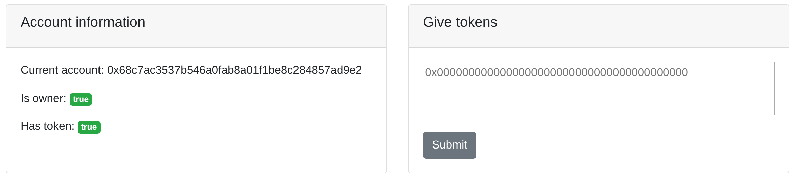

# AXVECO webpage token
A non-transferable token on the Ethereum blockchain that can be used by webpages to e.g. show an easter egg. The token can be distributed by a single owner account in the web interface.

